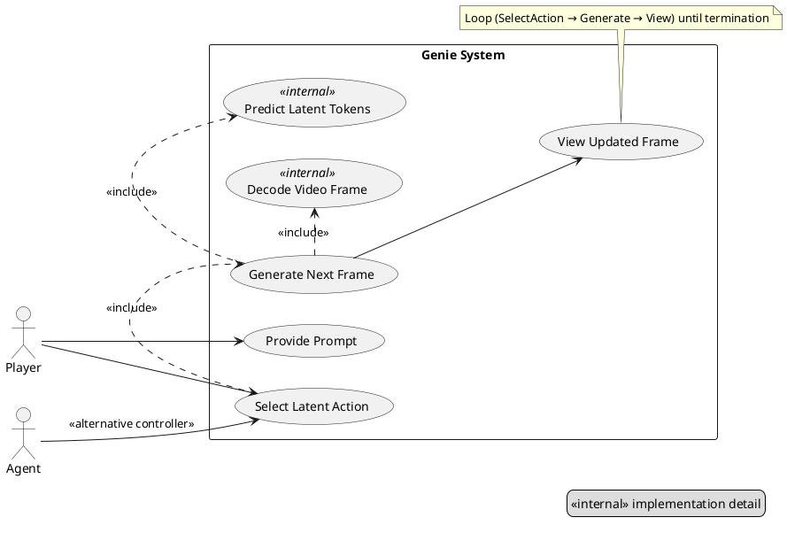

# Preventing PlantUML Use Case Diagram Mistakes (Genie Inference Case Study)

This hint explains the prior mistake in the Genie inference "Use Case" diagram, why it happened, and how to systematically prevent similar issues (semantic + tooling) when authoring PlantUML diagrams.

---
## 1. What Went Wrong (Case Summary)
| Aspect | Mistake | Impact |
|--------|---------|--------|
| Semantics | Chained arrow `U2 --> U3 --> U4 --> U5` treated like a sequence inside a *use case* diagram | Not valid UML semantics; muddied actor ↔ use case intentions |
| Scope | Loop modelled as a separate use case (`Iterate Trajectory`) | A loop is a behavioral note, not a user goal; misleads readers |
| Actor Roles | Player & Agent both directed to same internal flow without clarifying alternative control | Ambiguous controller responsibility |
| Internal Steps | Low‑level implementation (token prediction & decoding) exposed as top-level use cases | Mixed abstraction layers |
| Staleness | Old inline PlantUML fragment remained cached / rendered after externalization | Readers saw obsolete diagram + syntax error banner |
| Tooling | Outdated PlantUML runtime produced warning banner in SVG | Visual noise; distracts from content |

---
## 2. Correct Principles for UML Use Case Diagrams
1. **Actors interact only with *user-goal* use cases.** Internal algorithms belong in notes or <<internal>> use cases not directly linked to actors.
2. **Avoid modelling control flow (ordering, loops) as separate use cases.** Use notes, stereotypes, or activity / sequence diagrams instead.
3. **Use <<include>> for *mandatory* subfunctions** that always occur; **use <<extend>> for optional / conditional augmentations.**
4. **Maintain one abstraction level per diagram.** Hide token-level implementation behind internal or component diagrams.
5. **Prefer a system boundary (rectangle) named explicitly** to anchor scope.
6. **Keep actor alternatives explicit** using a stereotype or a brief label on the association (e.g., `<<alternative controller>>`).

---
## 3. Before / After Snippet
**Problematic (mixed semantics + flow arrows):**
```plantuml
@startuml
actor Player as P
rectangle GenieSystem {
  usecase "Select Latent Action" as U2
  usecase "Generate Next Tokens" as U3
  usecase "Decode Frame" as U4
  usecase "Display Frame" as U5
  usecase "Iterate Trajectory" as U6
}
P --> U2
U2 --> U3 --> U4 --> U5
U5 --> U6
U6 --> U2 : loop
@enduml
```

**Improved (clean goals + internal details separated):**


---
## 4. Systematic Prevention Workflow
| Stage | Checklist |
|-------|-----------|
| Author | Identify actors (external roles) → list *user goals* only → verify each is externally observable |
| Abstraction | Move algorithmic steps to: (a) internal use cases (<<internal>>), or (b) activity/sequence diagrams |
| Semantics | Replace flow arrows with <<include>> / <<extend>> or notes; never chain arrows for ordering |
| Review | Run `plantuml` CLI; ensure no syntax warnings & correct stereotypes |
| Refresh | Regenerate SVGs after *any* `.puml` change; ensure markdown references only the latest images |
| Validation | Open SVG; confirm no outdated warning banner (indicates old JAR) |
| Commit | Stage: `.puml`, regenerated `.svg`, updated markdown; avoid committing obsolete PNG/SVG pairs |

---
## 5. CLI Tooling Pattern
```bash
# 1. Keep a local tools directory
mkdir -p tools
curl -L -o tools/plantuml.jar \
  https://github.com/plantuml/plantuml/releases/latest/download/plantuml.jar

# 2. Regenerate all UML diagrams (SVG only)
java -jar tools/plantuml.jar -svg context/hints/*.puml
java -jar tools/plantuml.jar -svg reading-notes/slides/figures/*.puml

# 3. (Optional) List stdlib for theme checks
java -jar tools/plantuml.jar -language | grep theme
```
> Source: PlantUML downloads and CLI docs – https://plantuml.com/command-line

**Tip:** Add a script `scripts/render-uml.ps1` or `render-uml.sh` to batch regenerate; call it in CI to detect drift.

---
## 6. Pre-Commit Hook (Git) to Catch Stale Diagrams
```bash
#!/usr/bin/env bash
set -euo pipefail
JAR=tools/plantuml.jar
changed_pu=$(git diff --cached --name-only -- '*.puml')
[ -z "$changed_pu" ] && exit 0
for f in $changed_pu; do
  java -jar "$JAR" -svg "$f" >/dev/null
  svg=${f%.puml}.svg
  if ! git ls-files --error-unmatch "$svg" >/dev/null 2>&1; then
    git add "$svg"
  fi
  echo "Updated $svg"
  git add "$svg"
done
```
Add as `.git/hooks/pre-commit` (make executable). Prevents committing changed `.puml` without updated `.svg`.

---
## 7. Quick Semantic Sanity Checklist (Mnemonic: **A-G-I-L-E**) 
* **A**ctors: Only external roles outside system boundary.
* **G**oals: Each use case = externally meaningful outcome.
* **I**nternals: Mark with `<<internal>>` or move elsewhere.
* **L**oops & order: Express via notes or activity diagrams, not chained arrows.
* **E**xtensions: Use `<<include>>` / `<<extend>>` relationships correctly.

---
## 8. When to Use Another Diagram Type
| Intent | Prefer |
|-------|--------|
| Detailed token flow | Activity / Sequence |
| Component responsibilities | Component / Class diagram |
| Temporal action loop states | State machine |
| Performance or latency focus | Deployment / annotated sequence |

---
## 9. References
* Official PlantUML Use Case: https://plantuml.com/use-case-diagram
* Includes vs Extends: https://plantuml.com/use-case-diagram#1b9n3q1g5m9i4qwz
* General UML Guidance (OMG): https://www.omg.org/spec/UML

---
## 10. Quick Review Script (PowerShell Example)
```powershell
$jar = 'tools/plantuml.jar'
Get-ChildItem -Recurse -Filter *.puml | ForEach-Object {
  Write-Host ("Rendering {0}" -f $_.FullName)
  java -jar $jar -svg $_.FullName | Out-Null
}
Write-Host 'Done.'
```

---
## 11. Summary
The earlier incorrect diagram conflated *goal modelling* with *control flow*. By separating concerns (use cases vs internal processing) and enforcing a regeneration + review pipeline, you ensure diagrams stay semantically correct, current, and maintainable.
