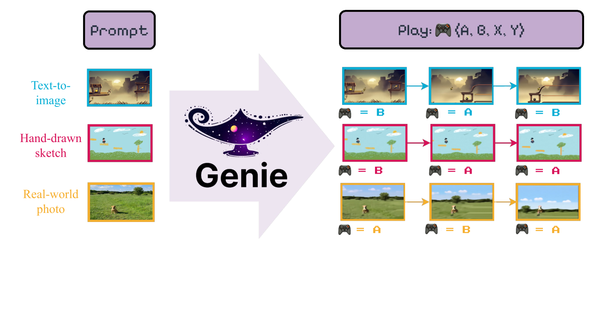
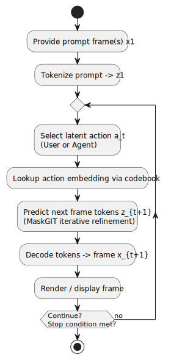
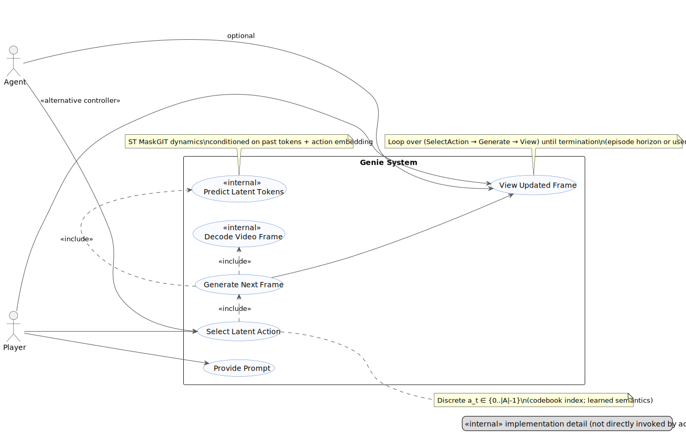

# Genie: Genie: Generative Interactive Environments

## 1. What is Genie?
* A large (≈11B params) foundation world model turning a **single prompt image** (text2img output / sketch / photo) into an **interactive, controllable 2D world**.
* Trained **only on unlabeled Internet videos** (platformer gameplay + robotics) – no actions, text, engine state.
* Interactivity via a **tiny discrete latent action space** (|A|=8) learned unsupervised (frame-by-frame control).
* Users or agents press latent “buttons” each timestep to advance the generated trajectory.
* Core joint idea:
	- Temporal-aware video tokenization.
	- Discrete latent action codebook capturing inter-frame change.
	- Autoregressive spatiotemporal dynamics model predicting next-frame tokens conditioned on chosen latent actions.

*Figure 1 (High-Level Concept):* **A whole new world** — Genie converts a variety of different prompts into interactive, playable environments that can be easily created, stepped into, and explored. This is made possible via a latent action interface, learned fully unsupervised from Internet videos. On the right (in the original banner) are example generated steps for two latent actions. More examples: https://sites.google.com/view/genie-2024/home

## 2. Technical Contributions (Condensed)
* Paradigm: **Generative Interactive Environment** (playable, not passive video).
* **Unsupervised latent action discovery** with VQ codebook (|A|=8) over pixels.
* **Unified ST Transformer** blocks for tokenizer, LAM, dynamics (linear-ish scaling in T for spatial cost).
* **ST-ViViT tokenizer**: temporal-aware, more efficient & better than C-ViViT.
* **MaskGIT dynamics + action embeddings** for sharper controllable prediction.
* **ΔPSNR controllability metric** (difference vs random actions).
* **Scaling study** across params & batch (40M→10B dyn model) shows smooth gains.
* **Cross-domain generality** (platformers + robotics) without labeled actions.
* **Policy transfer demo**: latent→real action mapping enables few-shot BC.

## 3. Inference Inputs & Outputs (Use Case Focus)
This section describes ONLY the runtime (inference) interaction loop—how a user (or autonomous agent) supplies inputs and receives outputs from Genie.

> "A player first prompts the model with an image $x_1$ that serves as the initial frame."  
> "The player then specifies a discrete latent action $a_1$ to take by choosing any integer value within $[0,|A|)$."  
> "The dynamics model takes the frame tokens $z_1$ and corresponding latent action ... to predict the next frame tokens $z_2$."  
> "This process is repeated to generate the rest of the sequence ... while tokens are decoded into video frames."

These quotes (Inference: Action-Controllable Video Generation section) define the inference contract we model below.

### 3.2 Inference Inputs
* **Prompt Frame(s)**: One (or few) initial image(s). Can be:
	- Hand-drawn sketch
	- Text-to-image output
	- Real-world photo
	- In-domain gameplay frame
* **Latent Action Selection per Timestep**: Discrete integer `a_t ∈ {0,…,|A|-1}` (|A| typically = 8) chosen by:
	- Human player (manual exploration)
	- Learned policy / agent (automated control)
* **(Optional) Stopping Condition**: User stop, max frames, or environment-specific termination.

### 3.3 Inference Outputs
* **Next Frame (RGB)**: Decoded visual frame `x_{t+1}` for display.
* **Updated Internal State (Implicit)**:
	- Appended token history `z_{1:t+1}` (not surfaced to user directly).
* **Interactive Trajectory**: Sequence of rendered frames forming a controllable rollout.

### 3.4 Black-Box Contract (Simplified API View)
Inputs: `(prompt_frame, action_sequence_stream)`  
Outputs: `stream_of_generated_frames` (1 frame per chosen action)  
Determinism: Stochastic due to sampling (e.g. MaskGIT temperature).  
Latency: Currently ~1 FPS (paper limitation).

### 3.5 Activity Diagram
Source: `figures/inference-activity.puml`  
Rendered: 

### 3.6 Use Case Diagram
Source: `figures/inference-usecases.puml`  
Rendered: 
Refined: Player/Agent choose a discrete latent action; generation wraps internal Predict/Decode steps via include relations; loop is conceptual (not a separate use case).

### 3.7 Step-by-Step Inference Flow (Narrative)
1. **Prompt**: User supplies initial frame `x_1` (any style).  
2. **Tokenization**: Video tokenizer encodes `x_1` → `z_1` (causal temporal context trivial at t=1).  
3. **Action Choice**: User/agent picks latent action index `a_1` (no predefined semantics; discovered empirically).  
4. **Embedding Retrieval**: Index into action VQ codebook → embedding `ã_1`.  
5. **Prediction**: Dynamics model consumes `(z_1, ã_1)` plus history → predicts masked tokens for frame 2 (iterative MaskGIT refinement).  
6. **Decoding**: Predicted tokens decoded to RGB frame `x_2`.  
7. **Render**: Frame displayed; loop returns to step 3 for next action until stop condition.  
8. **Termination**: User halts, frame budget exhausted, or external criterion met.

### 3.8 Key Properties
* **Frame-Level Controllability**: Every latent action immediately influences next frame (cited sentences above).
* **Consistency of Code Semantics**: Action meanings persist across prompts (paper note on learning controller buttons).
* **Open-Ended Prompting**: Accepts OOD visual prompts (sketches, photos) still enabling play.
* **Autoregressive Dependency**: Each token prediction conditioned on full prior token + action history.

---
This re-focused section excludes training data details to emphasize *runtime* usage and user/agent interaction.

## 4. Architecture Overview
**(a) Video Tokenizer (ST-ViViT VQ-VAE)**
* Causal temporal attention + spatial attention; produces discrete tokens z_t.

**(b) Latent Action Model (LAM)**
* Encoder gets x_{1:t} and x_{t+1}; outputs continuous latent → VQ code (ã_t).
* Auxiliary decoder reconstructs x_{t+1}; only codebook kept at inference.
* Pixel input (vs token input) improves controllability (higher ΔPSNR).

**(c) Dynamics Model (ST MaskGIT)**
* Inputs: past tokens z, latent action embeddings ã.
* Iterative masked token prediction (≈25 refinement steps, temp≈2).
* Additive action embeddings (not concatenation) → stronger control.

**ST Block Design**
* Spatial self-attn (per frame) → Temporal causal self-attn (same patch index over time) → single FFN.

## 5. Training Pipeline
1. Pretrain tokenizer (VQ-VAE) on clips (recon + commitment losses).
2. Jointly train LAM + dynamics:
	 * LAM: VQ loss + reconstruction from pixels; small codebook (|A|=8).
	 * Dynamics: cross-entropy on tokens with random masking rate U[0.5,1].
3. Inference: encode prompt frame → user selects action index each step → lookup embedding → predict next tokens → decode frame.

**Optimization & Scaling**
* Larger params & batch → monotonic loss reductions.
* Stabilization: bfloat16, QK norm.
* Final model: ~10.7–11B params (≈942B tokens seen, 125k steps).

**Robustness Choices**
* Random masking (denoising effect).
* Tiny action vocabulary → high semantic influence per code.

## 6. Metrics
* **FVD**: video fidelity.
* **ΔPSNR (controllability)**: PSNR(real, inferred-actions) − PSNR(real, random-actions); higher ⇒ actions matter more.

## 7. Results Snapshot
**Qualitative**
* OOD prompts (sketches, photos, text-generated) become playable.
* Robotics: coherent arm motions, object deformation (chips bag).
* Emergent parallax & depth layering.

**Quantitative / Ablations**
* ST-ViViT tokenizer FVD=81.4 vs ViT 114.5 & C-ViViT 272.7 (similar params).
* Pixel LAM ΔPSNR > token-input LAM (1.91 vs 1.33 Platformers).
* Scaling: smooth downward training loss with params & batch.

**Policy Transfer**
* Latent-labelled CoinRun demos + small mapping dataset (≈200 samples) → oracle-level BC performance.

## 8. Emergent Capabilities
* Stable latent action semantics across vastly different visual domains.
* Parallax-like multi-layer motion from single 2D prompt.
* Physical plausibility cues (deformables) from pure video data.

## 9. Limitations
* Short temporal context (16 frames) → limited long-horizon coherence.
* ~1 FPS generation → not yet real-time.
* Occasional hallucinations / drift over long rollouts.
* Latent action semantics unlabeled; requires user discovery.

## 10. Future Directions
* Longer context / hierarchical memory.
* Faster decoding (distillation, speculative multi-frame prediction).
* Larger, more diverse Internet video corpora (generalist world model).
* Hierarchical or compositional action vocabularies.
* Integration with agent training loops (planning, RL fine-tuning).

## 11. Broader Impact / Safety Notes
* Creative empowerment vs IP provenance & bias risks.
* Need moderation & safe deployment, especially for robotics.
* Transparent dataset sourcing & usage policies crucial.

## 12. Quick Glossary
* **Latent Action**: Discrete VQ code summarizing inter-frame change.
* **Video Token**: Discrete spatiotemporal patch embedding.
* **ST Block**: Spatial attn + causal temporal attn + single FFN.
* **MaskGIT Steps**: Iterative masked token refinement cycles.

---
Figure source images already exist under `papers/genie-tex/figures/`; reused directly without duplication.